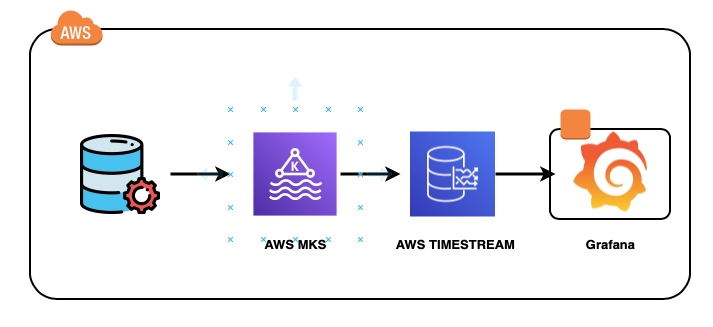

# bankaya-project

### Technical Questions

1. How do you build a Data Pipeline? Feel free to explain with a fictional example.

The steps I follow are:

1. Perform an analysis of the extraction source(s), this analysis should give us the answers of what type of server it is (on premise, cloud), where it is located, is it transactional, etc.
2. Having the above information, we proceed to perform a more specific analysis of the tables to be extracted to know what type of extraction will be performed (full, intraday, t-1, etc).
3. Here it is time to perform the analysis on the purpose of such extraction, i.e. who/what is going to use this data. Knowing the purpose helps us to know how to structure the pipeline, i.e. if we will first perform a load to some intermediate platform or if we will first perform a transformation of such data, etc.
4. Now it is time to proceed with the development of the pipeline.
5. We perform unit and functional tests.
6. We perform the release to the required environment.
7. We monitor its performance.
8. We validate the integrity of the data uploaded to the target source.

2. Explain the differences between OLAP and OLTP Systems.

Both are systems within a DBMS.
The main difference lies in the purpose of the data usage within them. For example, if we need to store and query live data that is the basis of a transactional system, we are referring to an OLTP processing system. On the contrary, if we need information from multiple sources with a history of several years back in order to perform analysis, then we are referring to an OLAP processing system.

3. What are the main features of a production data pipeline?

* The code must have passed all the necessary tests within the CI/CD flow.
* The code must have documentation.
* There should be documentation in case of deployment failure. Rollback.
* The pipeline should have been deployed and tested in a pre-production environment, e.g. pre-production.

4. How do you monitor a data pipeline? and If you have had experience with pipelines describe how you did it?

Normally I create alerts on the orchestrator of such pipeline that monitors each of the steps of the pipeline, such alerts can come in the form of mail, notifications within a platform such as Google Chats or Slack or even by text message.

5. Explain what a data contract is and how you would implement one.

As the name implies, it is a contract between the owner of the data to be extracted and processed, those involved in the processing and those interested in using the data. This contract has the necessary rules and definitions in order to achieve the objective following best practices and defining the scopes.

Normally when starting a project that includes the creation of a data pipeline, all interested parties gather in a Kick Off meeting to start with the definitions related to the project, here is where a minute is made in which apart from indicating everything discussed in the meeting, a file is attached in which the contract is contained.

6. Suppose you have to design an Anomaly Detection Solution for a client in real or near real time. A platform for anomaly detection is about finding patterns of interest (outliers, exceptions, peculiarities, etc.) that deviate from expected behavior within dataset(s). Given this definition, it’s worth noting that anomaly detection is, therefore, very similar to noise removal and novelty detection. Though patterns detected with anomaly detection are actually of interest, noise detection can be slightly different because the sole purpose of detection is removing those anomalies - or noise - from data. Which technologies do you apply for real time ingestion and stream for an anomaly detection system? Diagram the solution in AWS or GCP Infrastructure.

Once I tried to do something with the Kafka service, being a data streaming platform, within its SQL engine operations can be performed to detect unusual patterns within the data.
The following would be to use the Timestream service, a time-series database that makes it easier to store and analyze trillions of events per day and finally use Grafana as a visualization/monitoring platform.